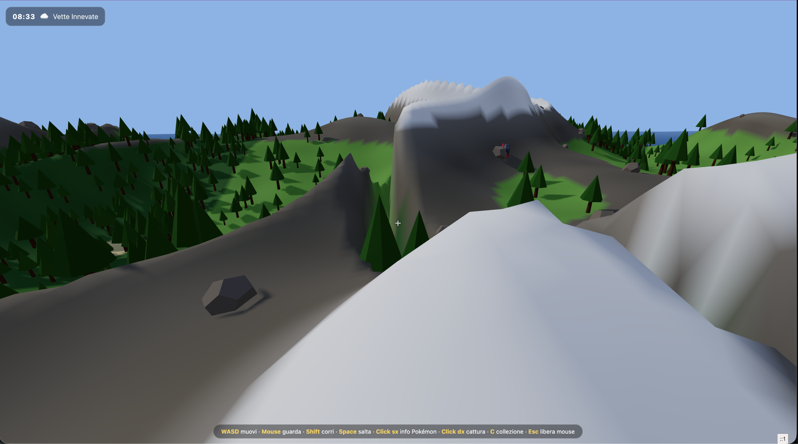
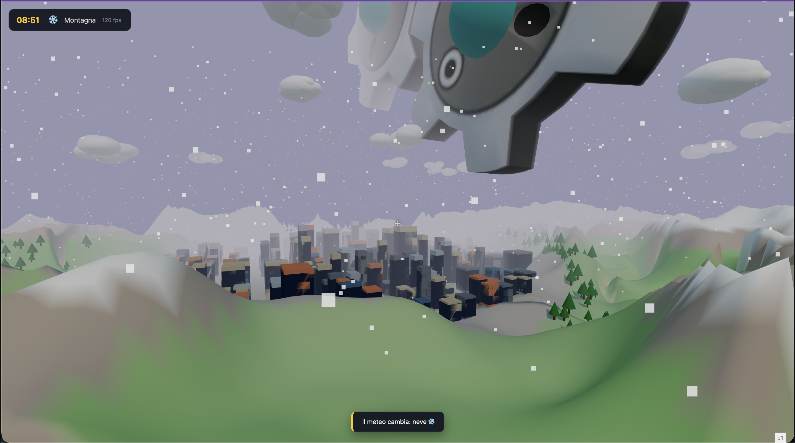
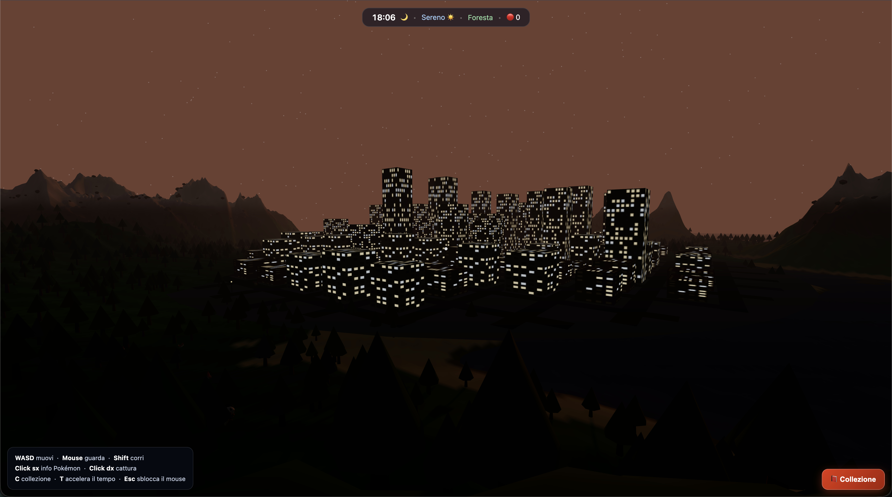

Elvis Presley had a great voice. So did a thousand guys you've never heard of, singing into a hairbrush in a thousand bedrooms. What made *him* The King wasn't the larynx — it was the band behind it, the hips, the lights, the Colonel working the room. The voice was necessary. It was nowhere near sufficient.

Software is having its Elvis moment. The LLM is the voice. The **harness** — the environment, the workflows, the context management, the orchestration — is the band, the hips, and the lights. And I wanted to know, with numbers instead of vibes, how much of "The King" is actually the voice.

So I ran the same experiment across seven configurations. What I didn't expect was that, late in the experiment, a kid with a *better* voice would walk into the room — and still lose to the guy with the moves.

For transparency: in some cases I was on a free tier, in others I used personal AI subscriptions or credits.

## The Prompt
> In this folder you must autonomously build the following project:
> An open-world, procedurally generated world with a 60-minute day-night cycle and dynamic weather conditions.
>
> Use Three.js or any other library you deem appropriate.
> The world must include natural elements such as mountains, rivers, forests, and lakes, as well as man-made structures like buildings and roads.
> Don't create random buildings and roads — instead, create a "city" biome of random size among the other biomes, with buildings of different heights and architectural styles. Make sure the city integrates harmoniously with the rest of the world, avoiding abrupt transitions between biomes.
> The day-night cycle must affect the world's lighting, with realistic light and shadow effects. During the day, the sun should illuminate the world with warm, intense light, while at night the scene should be lit by the moon in a softer way.
>
> In this world you must integrate Pokémon. Use the API https://pokeapi.co/ for Pokémon data, adapting them to biomes. Pokémon without compatible biomes will live in cities.
>
> The player has no body but moves the camera in first person. The camera must be controlled via mouse and keyboard, with the ability to move freely through the world. Implement a collision system to prevent the player from walking through solid objects like buildings, trees, or mountains.
>
> You also have an "assets" folder containing GLB files of Pokémon named by their Pokédex number. Some of these GLBs contain animations — when available, you must integrate them into the game to make the Pokémon more realistic and dynamic. They don't have standard names, so find a way to integrate them autonomously. I must be able to click on a Pokémon to display its name and stats, retrieved from the API, and see a random animation.
>
> If I right-click on a Pokémon, I should be able to catch it, adding it to a personal collection. The collection must be viewable at any time, showing the caught Pokémon with their stats and animations. Use the GLB to display the Pokémon in 3D with an eye-catching three-dimensional card containing its data such as stats, evolutions, etc.
>
> The solution must work autonomously by running "npm run start" and must install all libraries and perform all required setup. Launch everything on ports around 17500.

## The Results

Seven acts, one song sheet. Here's the lineup, worst to first — watch the score climb as the band gets bigger.

*   **Codex** _(Free tier, GPT 5.5 medium)_: The game simply doesn't work. I click "Start", the browser tells me it should have gone fullscreen, and the system just hangs there, motionless. **Score: 2/10**

*   **Claude Code** _(Haiku 4.5)_: Doesn't work, same as above. The game won't start, it freezes on the loading screen. **Score: 2/10**

*   **Cursor** _(Free tier, Composer 2.5 fast)_: On the first attempt the sprites weren't loading correctly, so I gave it another chance and pointed out the exact bug. It worked at that point, but with a small map, no animations, no UI element giving any sense of the day/night cycle, no weather effects, no procedural map. I ran out of credits just in time — it was doing one last pass in the internal browser. **Score: 5/10**

*   **Copilot** _(Opus 4.8, high effort)_: The game finally runs. Wide map, off-scale sprites, no animations, but the package is complete. Varied city and working collection. Still no procedural map. **Score: 6/10**

*   **Claude Code** _(Opus 4.8, high effort)_: Runs great. It included ambient animations like snow and animated Pokémon (even if the scale is a bit off) and the map is huge, yet not procedural. **Score: 8/10**

*   **Claude Code** _(Opus 4.8, ultracode with workflows)_: Staggering. Massive map with smoothly flowing biomes, mountains rising from the ground, collection with stunning cards and spot-on walk/idle animations. If the map had been truly procedural and infinite, I could have put it up for sale. **Score: 10/10**

Below is the video of this last test, because it's truly impressive and words don't do it justice. It's one minute long — I recommend watching the whole thing.

<iframe width="100%" height="480" src="https://www.youtube.com/embed/fJe7kDipcUg?si=tpozNMvxX7DhiIRC" title="YouTube video player" frameborder="0" allow="accelerometer; autoplay; clipboard-write; encrypted-media; gyroscope; picture-in-picture; web-share" referrerpolicy="strict-origin-when-cross-origin" allowfullscreen></iframe>

## The hardest test: Fable 5

You could read all of this as "better tooling wins" and leave it there. But the real test of that idea isn't a weaker model failing without a harness — it's a *stronger* one trying to win without one. So if the harness is really what makes the King, the cruel version of the test is obvious: give a rival a better voice and see who the crowd picks. And in my tests it went exactly the way it goes on stage — the crowd still picked the band.

In early July I finally got to run the test I'd been waiting for. Fable 5 was available again after the US-government freeze was lifted, and much of the online consensus was that the unlock had come at a price — the model supposedly weakened by the cybersecurity constraints added before release. In my testing it didn't feel that way at all, yet it's a thing to keep in mind.

I ran it under the same conditions as the naked Opus run: high effort, no workflow, no ultracode — the model on its own. It scored a **9**, one point above naked Opus (8). That much is expected: same bare setup, better model, better result.

What wasn't expected was *how* it got there. The prompt explicitly asked for a procedurally generated world, and until this run every configuration had sidestepped it — producing a large, sometimes enormous map, but a finite one. Even the 10/10 run, for all its polish, was really a very big diorama; I'd admitted as much when I said a truly procedural, infinite version would have been sellable. Fable actually did it: it generated the world on the fly, without bounds. It was the first run to satisfy the single hardest requirement in the prompt — and it did so with no harness at all.

So why a 9 and not a 10? Because the Opus 4.8 one was simply more beautiful, and the video makes it obvious: the rain and weather effects, the more harmonious lighting, the cleaner design throughout. Even the terrain-generation algorithm — Fable's own headline trick — was better in the Opus ultracode run. Fable satisfied the one requirement nobody else had met; the King's band won on everything around it. A better voice, a lesser show. Nine, not ten.

However, I want to give credit to a little gem I noticed. Look at this night scene from the Fable run:

Look at those lights. The city feels really alive. Wow.

N.B. I wasn't able to do a Fable 5 run in ultracode mode, my 20$ plan would burn just during the thinking process.

## Conclusions

Look at the data once more. The same engine — Opus 4.8 — powered three of these runs, and the results ranged from a frozen screen to something genuinely sellable. Same model, completely different outcome. That, on its own, is the argument for the harness.

Fable 5 doesn't undercut that argument; it refines it. What Fable made clear is a division of labour the Opus runs had hidden: the model determines the *ceiling* of what's possible, and the harness determines how much of that ceiling you actually reach. No amount of orchestration made any Opus run produce a truly procedural world — the capability wasn't there to orchestrate. Fable had it, unharnessed, immediately. Orchestration amplifies what a model can already do; it cannot manufacture what the model cannot.

The models are still climbing, and this one already does something incredible, yet, none of that moves the crown. Ten still beat nine — the better voice, naked, lost to a lesser one with a full production behind it — and I'm convinced that stays true for a long time. Not because the models will stop improving; they won't. Because a voice with no band, no arrangement, no stage is just a guy singing in a room, however good he is. Raw capability without reins doesn't go anywhere sensible; power without direction isn't a result.

If anything, the better the voice gets, the *more* production it needs to become a show. That's what people miss when they wait for the model that finally makes tooling obsolete: a stronger model doesn't shrink the harness's job, it raises the bar the harness has to clear. So the advice hasn't changed, and I don't think it will soon — invest in the environment around the model at least as much as in the model itself. The voice keeps getting better. The King still builds the band.