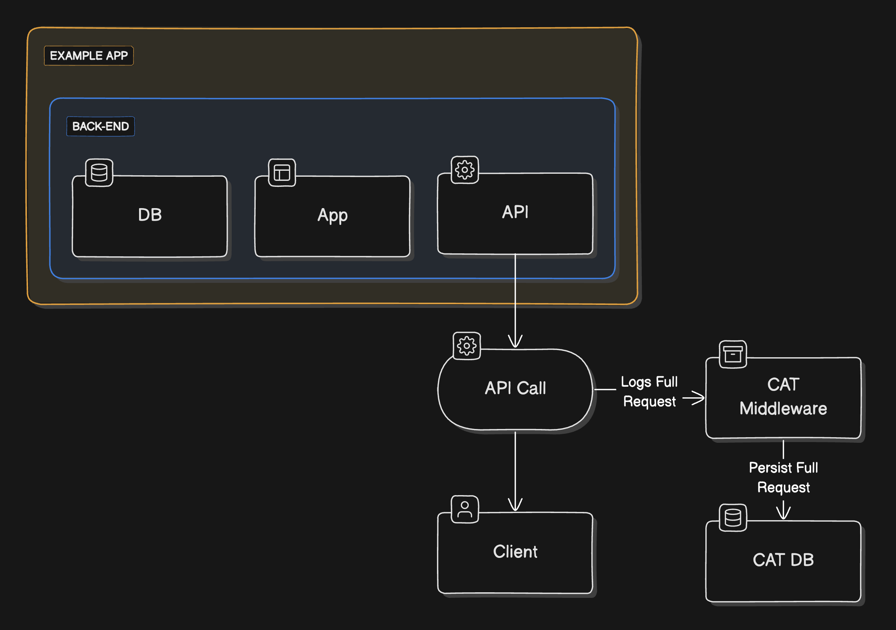
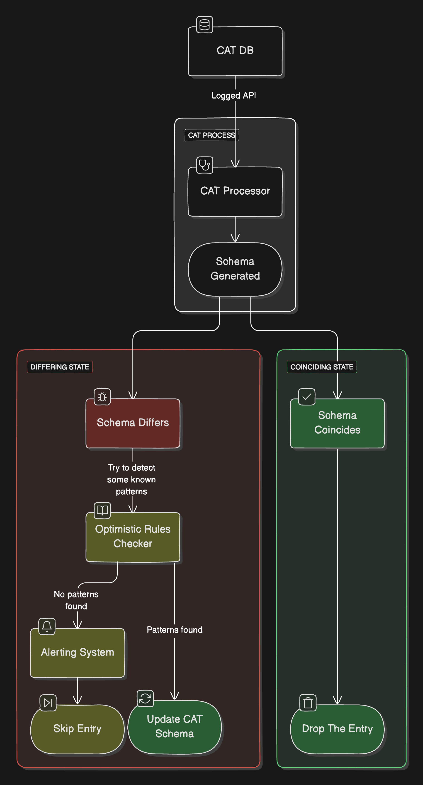

## Introduction

In my current role (Tech Lead @ Jointly), I'm almost involved in Back-End related stuff, which always ends up with some API design and development to make stuff available in front-end. **Some parts of the codebase are messy** and people have come and gone over the years, so it's not always easy to understand what's going on and which API exposes which information and why. I've been working on this codebase for the last year and a half, and **the team's main struggle has been about end-to-end front-end testing in CI**. Testing all the different scenarios of a user experience can be a real pain, especially when you have thousands of micro differences between every scenario you need to test, and creating each one of them can take months, without even considering the maintenance!

That's where, usually, Contract Testing comes into play, so you can take a step back and test the APIs themselves.

## Contract Testing

Contract Testing is a testing approach that focuses on the interactions between services. It's a way to ensure that the services are communicating correctly with each other and their way of communicating is not broken.

The idea is to define a contract between the services, which specifies the inputs and outputs of the services. This contract is then used to test consequent interactions (API calls, as an example) between the services. If the contract is violated, an alert is raised, and the issue can be addressed. This way, you can ensure that the services are working as expected and that they are communicating correctly with each other.

Contract Testing is a fantastic approach as it can help you catch bugs early in the development process.

> So, what's wrong with Contract Testing?

Well, nothing really. It's a great metodology, but it's not always enough. The problem with Contract Testing is the manual process needed to take it into action. You need to _write_ the contracts, you need to _test_ them, you need to _maintain_ them. It's a lot of work, and it's not always easy to keep up with it. You have to unveil and discover all your APIs hidden secrets (And _hell_, so many of them can be hidden very well in a decade-old codebase), and that can be time-consuming and error-prone. And if you're working on a large codebase with lots of APIs, it can be a real headache. If you are lucky enough, you'll need some months to get it done and working. If you're not, you'll need years or, worse, you'll never get it done because it will be unreliable and outdated as soon as you start using it.

_And here comes Iterative Contract Testing._

## Iterative Contract Testing

Iterative Contract Testing represents a different, but revolutionary - at least for us - approach to streamline the often arduous process of verifying API contracts. Traditionally, Contract Testing involves a meticulous manual effort to identify APIs, document their intricacies, and draft individual contracts before reaping the benefits. However, this iterative methodology flips the script by leveraging API responses as the cornerstone for generating contracts. By applying basic assumptions about the domain, this approach eliminates the need for labor-intensive test writing, instead allowing for continuous refinement through simple adjustments. In essence, Iterative Contract Testing offers a dynamic, self-improving framework that enhances efficiency and reliability without sacrificing simplicity.

> But.. how does it work?

**Let's start by saying we called our approach "Contract Adherence Tool" as the acronym is CAT. We love cats. We also have one appearing in your terminal when you use it. 🐈**

### Logging Requests

The process is simple. You start by writing a middleware that captures every API call in your application. This middleware logs the request and the response. Be aware, my suggestion is to **prevent any business logic** in this middleware, as an unseen bug can lead to breaking all your APIs. I suggest to simply log the request and the response, preventing any computation or manipulation of the data.

### Generating Contracts

Using a scheduled job - or using a Stream if you are cool enough - you can parse the logs and generate contracts. The contracts are generated by analyzing the API responses and manipulating them. This way, you can automatically generate contracts for all your APIs without having to manually write them.

_In our scenario, we created simple JSON schemas to define the contracts, but you can use any format that suits your needs._

The first time you encounter an API, you can generate a contract based on the response and consider it _valid_. The next time you encounter the same API, you will need to test it.

### Contract Testing

Once you have the contracts, you can use them to test the API. If the API response changes, you can optimistically search for patterns and update the contract accordingly - or you can look into it and fix the issue, if an issue exists. This way, next time the API response respects your latest contract, you'll be sure that everything is working as expected.

> What do you mean by "optimistically search for patterns"?

Well, let's say you have an API that returns a list of users. The first time you encounter this API, you generate a contract that defines the structure of the response. If the response changes the next time you encounter the API, you can look for patterns in the response and update the contract accordingly. For example, if the response now includes a new field, you can add this field to the contract. If the response now includes a new object, you can add this object to the contract. Those patterns, of course, depend on the domain you are working on.

In our case, we defined some _supersets_, like "Double", which replaces any number. This way, if our saved contract expects a number, and the response is a double, the contract will still be valid and will update itself to expect a double.

Also, we defined a pattern called _NULL replacement_, which allows the tool to replace a NULL value with any value found in a subsequent response. This way, if the contract says that a field is nullable, and the response is not null, the contract will update itself to expect the value found in the response. Of course, when faced with a NULL value, the contract will still be considered valid.

Those patterns are the ones we found most useful for our specific scenario, but you can define your own patterns based on your domain.

Lastly, we built a simple UI in which you can define non-mandatory fields, so the tool will not consider them when testing the API. This way, you can define a contract that is not too strict and will not break if the response changes in a non-mandatory field.

### Unexpected Benefits

When we started working on this tool, we didn't expect to find so many benefits. To be honest, it all started as a cool side project I had in mind and shared with the team. We tried to build it in a couple of days to have some fun and decided to share it in a learning session. And you know what? **We found a bug during the presentation.** I'm not joking. We launched the tool for the first time and found out we removed two fields from an API in the morning by mistake. We were able to fix it in a couple of minutes, and we updated the contract accordingly via the UI we created. We were all amazed by how easy it was for such a tool to catch a bug that would have been hard to find otherwise.

Also, we found out that the tool is a great way to drop unused APIs. If a contract isn't generated for an API in a certain amount of time, it means that the API is not used anymore. This way, we found out many APIs that were not used anymore and we are starting to remove them from the codebase.

### Performance Overhead

Of course, there is a performance overhead. You are logging every API call in your application, and you are parsing those logs to generate contracts. This can be a problem if you have a high-traffic application.

What we did was **find a compromise**. We only log the API calls in the staging environment, as it is used enough to be useful, but without being a real, production environment. To give you some numbers, we elaborate around 3000 API calls per day, and we have around 100 APIs, and we were able to generate all the contracts in a couple of days, tweaking them in a week to make them work. As of today, more than 10 APIs have been updated according to findings from CAT, and we are happy with the results.

## Conclusion

So, that's it. We found a way to test all our APIs without writing a single test. We are happy with the results, and we are planning to use this tool for the time being. A couple of days ago we were considering going open-source with it, but the tool as it is implemented is just too immature to be shared. We are planning to work on it in the next months and maybe, who knows, we will share it with the community.

Farewell, and happy coding! 🐈