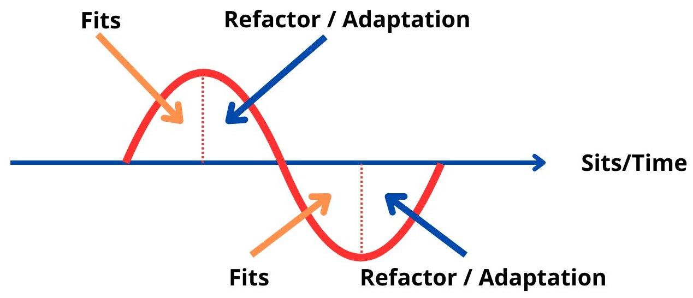

## Introduction.

> **[TL;DR]** It depends.

In software development, the concepts of rules, principles, and best practices form the backbone of our work. These are the foundational elements - what ***sits*** - that guide decisions, standardize processes, and ensure scalability in complex systems. They act as anchors, providing stability and a shared understanding across teams and projects.

Yet, no rule or practice exists in a vacuum. There are moments when the established path is not the best path. Context shifts, priorities change, and sometimes the solution lies in stepping outside the boundaries. These are the moments when ***fits*** - context-specific adaptations - become necessary to resolve unique challenges. The tension between ***sits*** and ***fits*** is the core of pragmatic software architecture.

In this article, I'll try to explain my vision and the value of ***fits***, or better said, **the importance of trade-offs**.

## The Value of "Sits": Structure and Scalability.

Every software project needs a framework - a set of rules and principles - to thrive. These frameworks are what "sits" represent. By adhering to these foundational practices, teams can create systems that are easier to maintain, extend, and scale over time.

### Consistency Across the Board.

Consistency is the unsung hero of software architecture. By following well-defined rules, developers can create predictable systems where new contributors can quickly understand the codebase. Consider the widespread use of design patterns such as MVC (Model-View-Controller). These patterns act as a shared language among developers, allowing teams to discuss and implement features without endless debate.

Consistency also plays a role in reducing cognitive load. For instance, adopting a single testing framework across the organization (e.g., Vitest for JavaScript projects) means that developers don't need to switch mental gears when moving between repositories. This small reduction in mental friction can lead to significant productivity gains over time.

### Maintainability Through Clear Rules.

Best practices often emerge to solve recurring problems. Take the principle of separation of concerns. By dividing code into distinct layers - presentation, logic, and data - you make it easier to identify and resolve bugs. For example, debugging a UI bug becomes simpler when the logic is encapsulated in a service layer rather than tangled in view components.

Moreover, clear rules prevent tech debt from spiraling out of control. Following SOLID principles in object-oriented programming ensures that components remain modular and adaptable. Violating these principles might work in the short term, but over time, the cost of these violations compounds, turning minor issues into systemic problems.

### Scalability: Building for Growth.

When designing systems, scalability is often a key concern. Principles like horizontal scaling and stateless services allow architectures to handle increased loads without dramatic redesigns. Kubernetes, for instance, thrives on stateless containers that can be scaled up or down seamlessly. These practices might not seem essential during initial development, but as traffic grows, their importance becomes apparent.

However, sticking rigidly to these principles can sometimes choke innovation or delay delivery. This is where ***fits*** come into play.

---

## When Fits Prevails: Breaking Rules for Context.

While ***sits*** provide structure, they can also impose constraints that are unnecessary in certain contexts. The ability to recognize when breaking the rules serves the greater good is a clear sign of an experienced architect.

> Nothing is JUST a Technical Decision.

This phrase has been said many times by a dear friend of mine, Luca Mezzalira, and it resonates with me **a lot**.

The most important lessons I've learned in software architecture is that no decision is purely technical. Every choice we make has implications for the business, the team, and the product's future. A technical decision can impact budgets, timelines, and even team morale. It's essential to recognize this interconnectedness to make informed choices.

It's a powerful reminder that we, as architects and developers, operate at the intersection of technology and business, and our decisions must serve both dimensions.

By keeping this in mind, I've learned to approach every architectural choice with a broader perspective, considering not only the immediate technical benefits but also the ripple effects on stakeholders and long-term goals.

> Organizations which design systems are constrained to produce designs which are copies of the communication structures of these organizations.

Melvin Conway - 1967

### Examples of Sits and context-specific Fits.
Let's consider some common examples of ***sits*** in software architecture:

- **Polymorphism in OOP:** Reducing redundancy by encapsulating shared logic in parent classes.
- **Comprehensive unit testing:** Ensuring that changes don't introduce regressions, especially in large codebases.
- **Event-driven architecture:** Decoupling components to improve scalability and maintainability.
- **Contract Testing:** Verifying that APIs adhere to predefined contracts to prevent breaking changes.

#### Sit #1: Polymorphism in OOP.

In software circles, hardcoding a condition with an `if` statement is often considered a bad practice. It can lead to brittle code that's hard to maintain. Yet, in small to medium-sized businesses, where budgets and timelines are tight, a single `if` statement might solve a customer's issue in minutes. When a high-value client requests a specific customization, writing an elaborate, reusable abstraction using polymorphism might be overkill.

> What? Breaking the rules is  something to be done in no case at all? Try to be a 50-people business being asked by a 100.000+ employee Mega Corp to add some Confetti in the intranet you developed for them. What? You don't want to? Well, read the 452-page contract you  blindly signed again and look at the penalty you should pay in case you don't do it respecting the SLA.

The key, here, is understanding the trade-offs:

- **Short-term gain:** Immediate satisfaction of the client's need.
- **Long-term cost:** Potential maintenance issues as more customizations pile up.

#### Sit #2: Comprehensive unit testing.

The pursuit of 100% test coverage is another example where pragmatism trumps dogma. While comprehensive testing is valuable, focusing on critical paths — like the checkout flow in an e-commerce app — often delivers more ROI (Return of interest) than exhaustive tests for minor features. In my article, [The Truth About Test Coverage](/blog/en/the-truth-about-test-coverage), I try to demonstrate how understanding the limits of metrics like coverage leads to better decision-making.

#### Sit #3: Event-driven architecture.

Event-driven architecture (EDA) is a powerful paradigm for building scalable, decoupled systems. However, using events everywhere can lead to unnecessary complexity in small applications. Even in distributed systems, many interactions might be synchronous, making RESTful APIs a more straightforward choice. The opposite is also true: in a monolithic application, finding a use case for asynchronous communication might bring huge value, even if that would mean breaking the "monolith" rule.

#### Sit #4: Contract Testing.

Contract testing is a methodology that ensures APIs adhere to a predefined contract. The standard approach involves manually defining these contracts, which can be time-consuming and error-prone in legacy codebases. Instead, in [Iterative Contract Testing](/blog/en/iterative-contract-testing), we leveraged API responses themselves to generate contracts dynamically. This ***fit*** reduced overhead while maintaining reliability.

By introducing patterns like optimistic schema updates, we sidestepped the initial burden of mapping every API. While this approach might not suit every scenario, it exemplifies how bending traditional practices can yield substantial benefits in specific contexts.

---

## Rules, Exceptions, and the Pragmatic Architect.

> Pragmatism in architecture isn't about ignoring the rules; it's about knowing when to break them.

### Why Rules Aren't Always Universal.

The debate between ***sits*** and ***fits*** ultimately boils down to trade-offs. Blindly following best practices can lead to inefficiencies, while ignoring them entirely invites chaos. The art of software architecture lies in discerning the appropriate path for a given context.

### Over-Engineering as a Pitfall of Sits.

Over-engineering occurs when solutions are designed with more complexity than necessary. This often stems from an overzealous application of best practices. For instance, implementing a microservices architecture for a small application can introduce unnecessary overhead in deployment, monitoring, and debugging.

### Strategic Fits in Action.

Conversely, there are scenarios where unconventional approaches shine. In [Asynchronous Batching](/blog/en/asynchronous-batching), grouping requests in Node.js with Fastify provided a lightweight solution to repetitive tasks, reducing computational waste. While it deviated from traditional REST principles, it delivered exceptional performance improvements.

### Tracking Technical Debt in Fits Scenarios.

When breaking traditional rules in favor of a ***fits*** approach, one of the most significant risks is the accumulation of technical debt. To mitigate this, I've developed a habit of documenting these decisions through a lightweight version of Architecture Decision Records (ADRs). These simil-ADRs act as living documentation, capturing the rationale behind the deviation and providing a roadmap for revisiting the decision in the future.

Each simil-ADR includes:

- **Context and Problem Statement:** Why the ***fit*** was chosen over the ***sit***.
- **Considered Options:** What was done and how it deviates from standard practices.
- **Outcome:** Notes on whether the deviation served its purpose or needs to be readdressed.

By maintaining this practice, I ensure that deviations are not forgotten but become part of a larger strategy. Revisiting these records allows me to assess whether they should be rectified to align with long-term goals or kept as-is because they fulfill their specific purpose effectively. This approach keeps the balance between pragmatism and architectural integrity.

### Intentional Governance in Software Architecture.

One fundamental yet often overlooked aspect of effective architecture is the practice of intentional governance. Governance ensures that architectural decisions align with business goals and technical needs while maintaining the flexibility to adapt to changing circumstances.

Intentional governance involves defining clear principles and boundaries without overburdening teams with unnecessary restrictions. For instance, rather than mandating the use of a specific technology stack across all projects, governance might focus on broader objectives like ensuring security, scalability, and maintainability. This approach empowers teams to make context-sensitive decisions while adhering to overarching architectural goals.

Core aspects of intentional governance include:

- **Guiding Principles:** Establishing high-level rules that teams can interpret based on their specific contexts.
- **Decision Frameworks:** Providing tools or processes, like Architecture Decision Records (ADRs), to document and evaluate trade-offs.
- **Continuous Review:** Regularly revisiting decisions to ensure they remain aligned with evolving goals and constraints.

By practicing intentional governance, organizations can strike a balance between consistency and adaptability, fostering innovation while maintaining structural integrity.

_Thank you, Alessandro Cappellozza, for this amazing representation._

---

## Conclusion.

### The Pragmatism Test.

When deciding between ***sits*** and ***fits***, consider the following questions:

- **What is the immediate goal?** Does this decision help achieve it?
- **What are the long-term implications?** Will this create tech debt that's difficult to resolve?
- **Does the deviation simplify or complicate the system?** Simplicity should be a guiding principle.

> Luciano Mammino, a dear friend of mine, suggested to include this awesome article which explains the Amazon model, which I suggest as an addition to this test: [One-way vs Two-way door decisions](https://thoughtbot.com/blog/one-way-vs-two-way-door-decisions)

### Other Powerful Questions to Ask.

- "Are the rules keeping me on track, or are they unnecessarily complicating my work?"
- "If I break this rule, can I explain why it's justified in this context?"
- "Will this decision hold up under scrutiny six months from now?"

### See you in the Next One.

In software architecture, both ***sits*** and ***fits*** have their place. The key is not choosing one over the other but understanding when to lean on foundational principles and when to adapt them to the context. This balance - the pragmatism in architecture - separates competent developers from great architects.

As Mark Richards and Neal Ford remind us: *"Everything in software architecture is a trade-off."* Embrace that reality, and use it to guide your decisions.

> Obvious things are always useful, especially when they are not obvious.