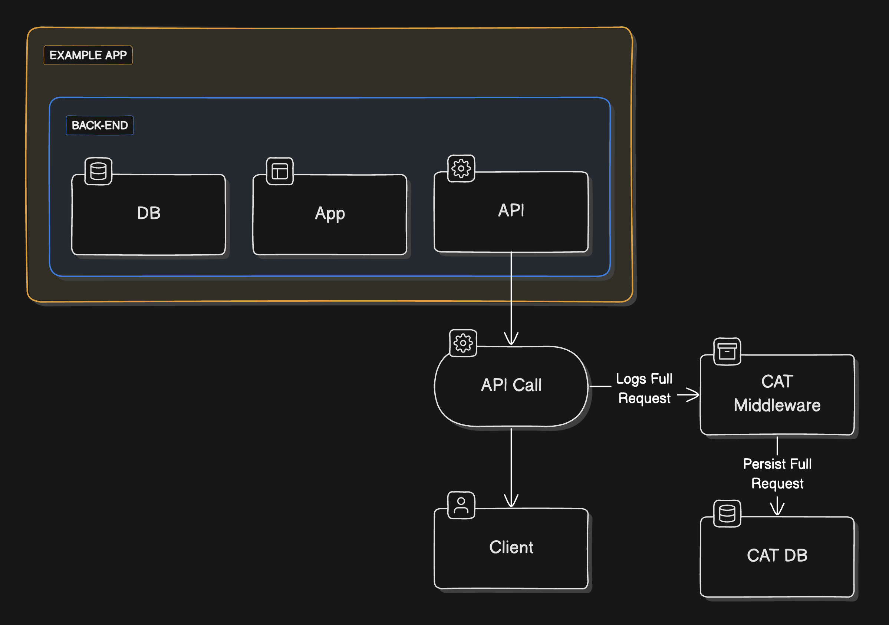
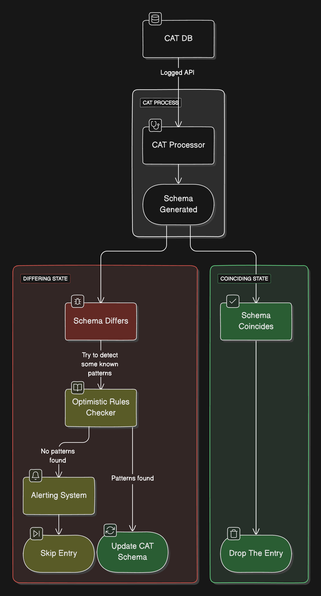

## Introduzione

Nel mio ruolo attuale (Tech Lead @ Jointly), sono quasi sempre coinvolto in cose relative al back-end, che finiscono sempre con la progettazione e lo sviluppo di API per rendere le cose disponibili nel front-end. **Alcune parti del codice base sono un bel casino** e le persone sono andate e venute nel corso degli anni, quindi non è sempre facile capire cosa stia succedendo e quale API esponga quali informazioni e perché. Ho lavorato su questa base di codice nell'ultimo anno e mezzo e **la difficoltà principale del team è stata il test front-end end-to-end in CI**. Testare tutti i diversi scenari di un'esperienza utente può essere una vera seccatura, soprattutto quando hai migliaia di microdifferenze tra ogni scenario che devi testare, e crearli tutti può richiedere mesi, senza nemmeno considerare la manutenzione!

È qui che, di solito, entra in gioco il Contract Testing, che ti permette di fare un passo indietro e testare le API stesse, indipendentemente dall'intera esperienza utente.

## Contract Testing

Il Contract Testing è un approccio di test che si concentra sulle interazioni tra i servizi. È un modo per garantire che i servizi comunichino correttamente tra loro e che il loro modo di comunicare non si rompa.

L'idea è quella di definire un contratto tra i servizi, che specifichi gli input e gli output degli stessi. Questo contratto viene poi utilizzato per testare le conseguenti interazioni (chiamate API, ad esempio) tra i servizi. Se il contratto viene violato, viene generato un avviso e il problema può essere risolto. In questo modo puoi assicurarti che i servizi funzionino come previsto e che comunichino correttamente tra loro.

Il Contract Testing è un approccio fantastico in quanto può aiutarti a individuare i bug già dalle prime fasi del processo di sviluppo.

> Quindi, cosa c'è di sbagliato nel Contract Testing?

Beh, in realtà niente. È un'ottima metodologia, ma non sempre è fattibile. Il problema con il Contract Testing è il processo manuale necessario per metterlo in atto. Devi _scrivere_ i contratti, devi _testarli_, devi _mantenerli_. Il lavoro è tanto e non è sempre facile stargli dietro. Devi svelare e scoprire tutti i segreti nascosti delle tue API (e _diavolo_, ce ne possono essere parecchi nascosti molto bene in una codebase vecchia di dieci anni!), e questo può richiedere molto tempo ed è prono a errori. E se stai lavorando su una codebase di grandi dimensioni con molte API, l'emicrania è dietro l'angolo. Se sei fortunato, ti serviranno alcuni mesi per completare e far funzionare il sistema. Se non lo sei, ti serviranno anni o, peggio, non andrai mai online perché diventerà inaffidabile e obsoleto non appena inizierai a usarlo.

_Ed ecco che arriva ciò che definiamo "Iterative Contract Testing"._

## Iterative Contract Testing

Il test iterativo dei contratti rappresenta un approccio diverso, ma rivoluzionario - almeno per noi - per semplificare il processo, spesso arduo, di verifica dei contratti API. Tradizionalmente, il Contract Testing comporta un meticoloso sforzo manuale per identificare le API, documentarne tutte le condizioni e redigere i singoli contratti prima di raccoglierne i benefici. Tuttavia, questa metodologia iterativa riscrive il copione sfruttando le risposte API come punto di partenza per la generazione di contratti. Applicando alcune assunzioni di base sul dominio in cui si lavora, questo approccio elimina la necessità di scrivere complessi test, consentendo invece un perfezionamento continuo attraverso semplici aggiustamenti. In sostanza, l'Iterative Contract Testing offre un quadro dinamico e di auto-miglioramento che migliora l'efficienza e l'affidabilità senza sacrificare la semplicità.

> Ma.. come funziona?

**Iniziamo col dire che abbiamo chiamato il nostro approccio “Contract Adherence Tool” in quanto l'acronimo è CAT. Adoriamo i gatti. Ne abbiamo anche uno che appare nel tuo terminale quando lo usi. 🐈**

### Log delle richieste

Il processo è semplice. Inizi scrivendo un middleware che acquisisca ogni chiamata API nella tua applicazione. Questo middleware registra la richiesta e la risposta. Il mio suggerimento è di **prevenire qualsiasi business logic** in questo middleware, poiché un bug nascosto potrebbe portare alla rottura di tutte le tue API. Suggerisco di registrare semplicemente la richiesta e la risposta, impedendo qualsiasi calcolo o manipolazione dei dati in questa fase.

### Generazione di contratti

Utilizzando un job schedulato - o uno stream se sei abbastanza fico -, puoi analizzare i log e generare contratti. I contratti vengono generati analizzando le risposte API e manipolandole. In questo modo, puoi generare automaticamente contratti per tutte le tue API senza doverli scrivere manualmente.

_Nel nostro scenario abbiamo creato semplici JSON schema per definire i contratti, ma puoi utilizzare qualsiasi formato adatto alle tue esigenze._

La prima volta che incontri un'API, puoi generare un contratto basato sulla risposta e considerarlo _valido_. La prossima volta che incontrerai la stessa API, dovrai testarla.

### Contract Testing

Una volta che hai i contratti, puoi usarli per testare l'API. Se la risposta dell'API cambia, puoi fare una ricerca ottimistica di modelli e aggiornare il contratto di conseguenza oppure puoi esaminarlo e risolvere il problema, se un problema esiste. In questo modo, la prossima volta che la risposta dell'API rispetterà il tuo ultimo contratto, sarai sicuro che tutto funzioni come previsto.

> Cosa intendi con "ricerca ottimistica di modelli"?

Beh, supponiamo che tu abbia un'API che restituisca alcuni dati di un utente. La prima volta che incontri questa API, generi un contratto che definisce la struttura della risposta. Se la risposta cambia la prossima volta che incontri l'API, puoi cercare modelli nella risposta e aggiornare il contratto di conseguenza. Ad esempio, se la risposta ora include un nuovo campo, puoi aggiungere questo campo al contratto. Se la risposta ora include un nuovo oggetto, puoi aggiungere questo oggetto al contratto. Questi modelli, ovviamente, dipendono dal dominio nel quale stai lavorando.

Nel nostro caso, abbiamo definito alcuni _superset_, come _Double_, che sostituisce qualsiasi numero. In questo modo, se il nostro contratto salvato prevede un _Integer_ e la risposta è un _Double_, il contratto sarà comunque valido e si aggiornerà per aspettarsi un _Double_ la prossima volta.

Inoltre, abbiamo definito un modello chiamato _NULL replacement_, che consente allo strumento di sostituire un valore NULL con qualsiasi valore trovato in una risposta successiva. In questo modo, se il contratto dice che un campo è _NULL_ e la risposta non lo è, il contratto si aggiornerà per aspettarsi il valore trovato nella risposta. Naturalmente, di fronte ad un valore _NULL_ in una futura analisi, il contratto sarà comunque considerato valido.

Questi modelli sono quelli che abbiamo trovato più utili per il nostro scenario specifico, ma puoi definire i tuoi modelli in base al tuo dominio.

Infine, abbiamo creato una semplice interfaccia utente in cui puoi definire campi non obbligatori, in modo che lo strumento non li consideri durante il test dell'API. In questo modo puoi definire un contratto che non sia troppo rigido e che non si rompa se la risposta cambia in un campo non obbligatorio.

### Benefici inaspettati

Quando abbiamo iniziato a lavorare su questo strumento non ci aspettavamo di trovare così tanti vantaggi. Ad essere onesti, tutto è iniziato come un progetto parallelo interessante che avevo in mente e che ho condiviso con il team. Abbiamo provato a costruirlo in un paio di giorni per divertirci e abbiamo deciso di condividerlo in una sessione di learning. E sai cosa? **Abbiamo riscontrato un bug durante la presentazione.** Non sto scherzando. Abbiamo lanciato lo strumento per la prima volta e abbiamo scoperto di aver rimosso per errore due campi da un'API il mattino stesso. Siamo riusciti a risolverlo in un paio di minuti e abbiamo aggiornato il contratto di conseguenza tramite l'interfaccia utente che abbiamo creato. Siamo rimasti tutti stupiti da quanto sia stato facile per uno strumento del genere individuare un bug che altrimenti sarebbe stato difficile da scovare.

Inoltre, abbiamo scoperto che lo strumento è un ottimo modo per eliminare le API inutilizzate. Se non viene generato un contratto per un'API entro un certo periodo di tempo, significa che l'API non viene più utilizzata. In questo modo, abbiamo scoperto molte API che non venivano più utilizzate e stiamo iniziando a rimuoverle dalla codebase.

### Performance Overhead

Naturalmente c'è un sovraccarico in termini di prestazioni. Stai registrando ogni chiamata API nella tua applicazione e stai analizzando quei log per generare contratti. Questo può essere un problema se si dispone di un'applicazione a traffico elevato.

Ciò che abbiamo fatto è stato **trovare un compromesso**. Registriamo le chiamate API solo nell'ambiente di staging, poiché è abbastanza utilizzato per essere utile, ma rimuovendo il problema in produzione. Per darti qualche numero, elaboriamo circa 3000 chiamate API al giorno, abbiamo circa 100 API, e siamo riusciti a generare tutti i contratti in un paio di giorni, modificandoli in una settimana per farli funzionare. Ad oggi, più di 10 API sono state aggiornate in base ai risultati di CAT e siamo estremamente soddisfatti dei risultati.

## Conclusione

Siamo arrivati alla fine del racconto. Abbiamo trovato un modo per testare tutte le nostre API senza scrivere un singolo test. Siamo soddisfatti dei risultati e contiamo di utilizzare questo strumento d'ora in poi. Qualche giorno fa stavamo pensando di renderlo open source, ma lo strumento così come è implementato è semplicemente troppo immaturo per essere condiviso. Stiamo programmando di lavorarci nei prossimi mesi e forse, chissà, lo condivideremo con la community.

Addio, e buona programmazione! 🐈
